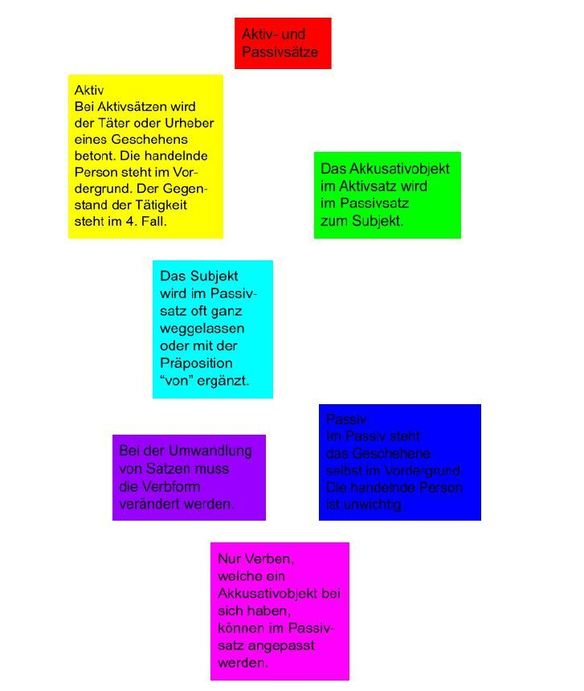
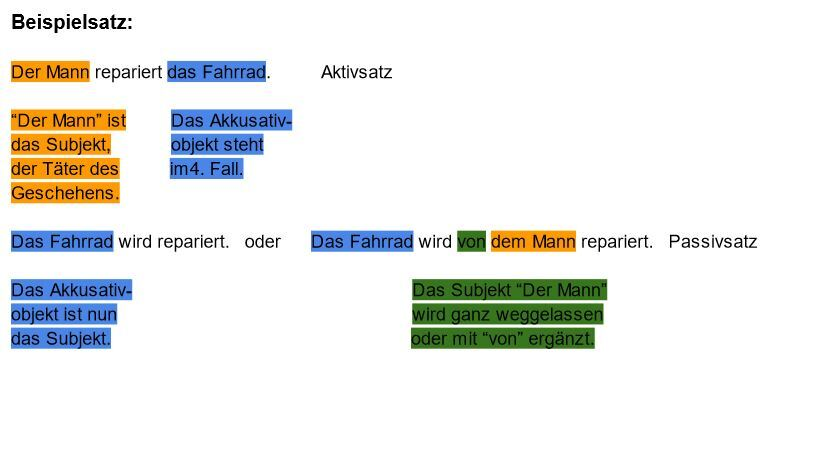

+++
title = "Aktiv- und Passivsätze"
date = "2022-02-08"
draft = true
pinned = false
image = "deutsche-grammatik.jpg"
description = "Ich habe gerade an dem Thema Aktiv- und Passivsätze gearbeitet. Hier sind einige wichtige Regeln dazu."
+++

