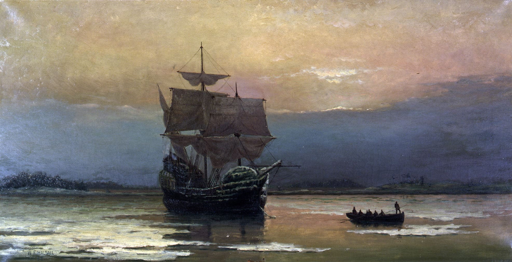

+++
title = "Einwanderung Amerika - ein Interview"
date = "2021-11-03"
draft = false
pinned = false
image = "mayflower_in_plymouth_harbor-_by_william_halsall-1-1-.jpg"
description = "In letzter Zeit habe ich an einem Vortrag über die Einwanderer aus Europa nach Amerika gearbeitet. Zum Schluss hat mir meine Mama einige Fragen dazu gestellt:"
+++

**Wie kamst du auf dieses Thema?**

Papa hat es auf SRF Myschool gesehen und mir vorgeschlagen.

**War die Recherche einfach?**

Es geht so, ich habe vor allem gegooglet. Nervig war wenn ich auf eine Frage sehr lange keine Antwort gefunden habe und sie dann immer wieder umformulieren musste.

**Woher hattest du die Informationsquellen?**

Vor allem von Wikipedia oder SRF Myschool.

**Was fandest du besonders interessant?**

Ich fand eigentlich alles spannend, vor allem aber die Überfahrt mit dem Schiff.

**Warum?**

Viele hatten kein Geld. Für die Überfahrten zu bezahlen haben sie sich teilweise für Jahre verschuldet. Auch sind immer wieder Auswanderer gestorben auf den Schiffen.

**Gab es Themen womit du Mühe hattest oder die bei dir Fragen aufgeworfen haben?**

Keine Ahnung.

**Könnte so eine ähnliche Auswanderung heute oder in Zukunft nochmals passieren? Wenn ja, unter welchen Voraussetzungen?**

Es könnte nochmal passieren wenn, ein weiterer  Kontinent gefunden wird oder vielleicht wenn man einen neuen Planet mit den richtigen voraussetzungen findet und dann zu ihm fliegt.