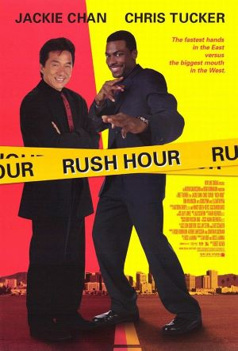

+++
title = "Stosszeit"
date = "2021-12-14"
draft = true
pinned = false
image = "rush-hour.jpg"
description = "Neulich habe ich eine Gymer-Prüfungsserie gelöst. Dabei musste ich einen Text zum Thema \"Schulweg mit dem ÖV\" und dem Titel \"Stosszeit\" schreiben:"
+++
<!--StartFragment-->

Ich stehe auf dem Trottoir und warte auf den Bus. Es ist kalt und es regnet. Mit jedem Atemzug ziehe ich die eisige Luft ein und stosse sie wie eine kleine, weisse Rauchwolke wieder aus.

Da, endlich kommt er. Ich und die Anderen, die gewartet haben, drängeln uns in den schon vollen Bus. Sobald sich die Türen schliessen wird es wärmer, meine roten, kalten Hände brennen von diesem plötzlichen Temperaturunterschied. Ich schaue mich um, ein paar sind wie immer die gleichen Menschen aber ich sehe auch jedes mal neue Gesichter. Die meisten schauen auf ihr Handy oder durch die Fenster, an den Seiten des Busses, nach draussen. An jeder Haltestelle kommen mehr Menschen hinein und jedes mal wenn die Türen aufschwingen, schlägt mir ein eisiger, von Regen durchzogener Wind entgegen. Als der Bus meine Haltestelle erreicht, schiebe ich mich durch die Menschenmasse nach draussen, es regnet nun nicht mehr so stark und ich gehe mit schnellen Schritten meinen Weg entlang. Um mich herum sind immer noch viele Menschen, die auf dem Weg zur Arbeit oder sonst wohin sind. Ich erreiche Bald meine Schule, ein Blick auf meine Armbanduhr sagt mir, dass ich pünktlich bin. Ich atme noch einmal tief ein und betrete dann das warme, fast noch menschenleere Gebäude.

<!--EndFragment-->